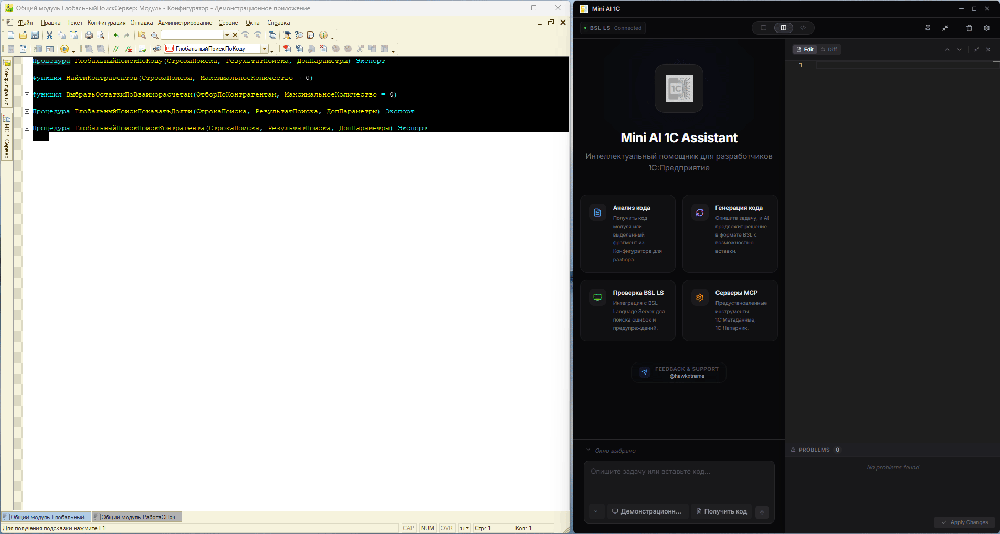
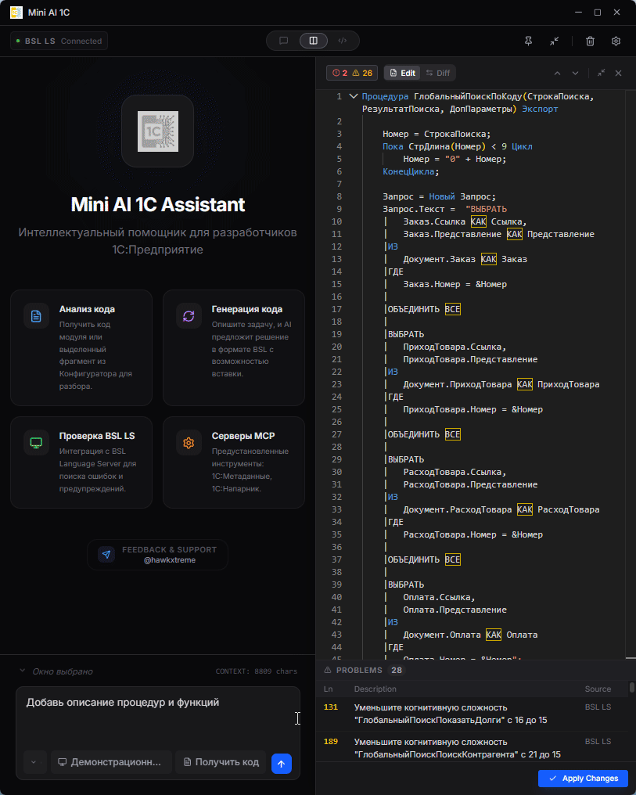
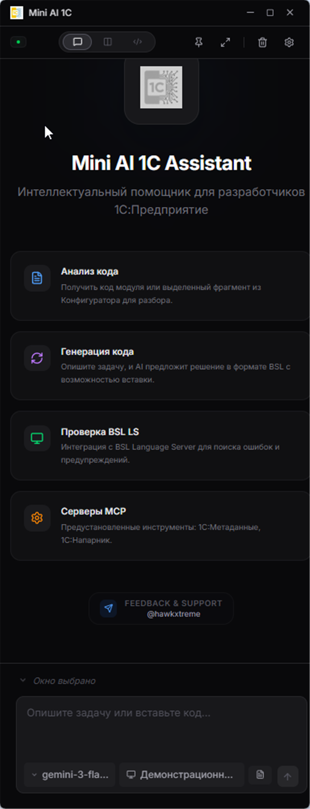
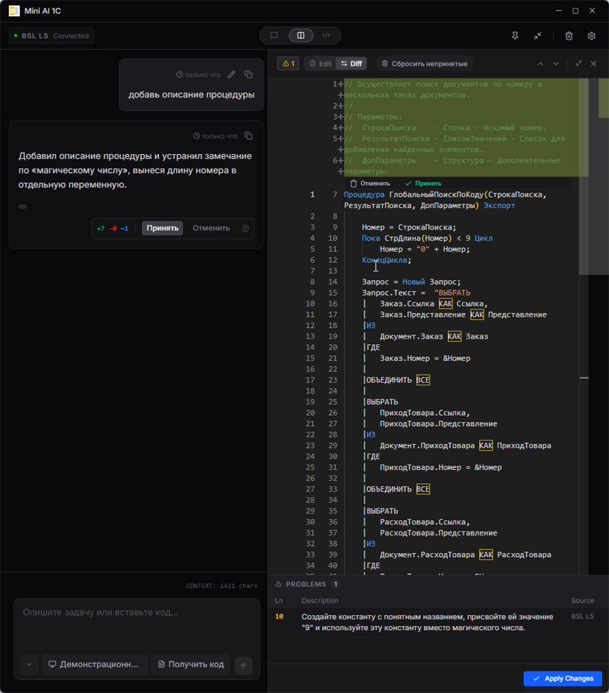
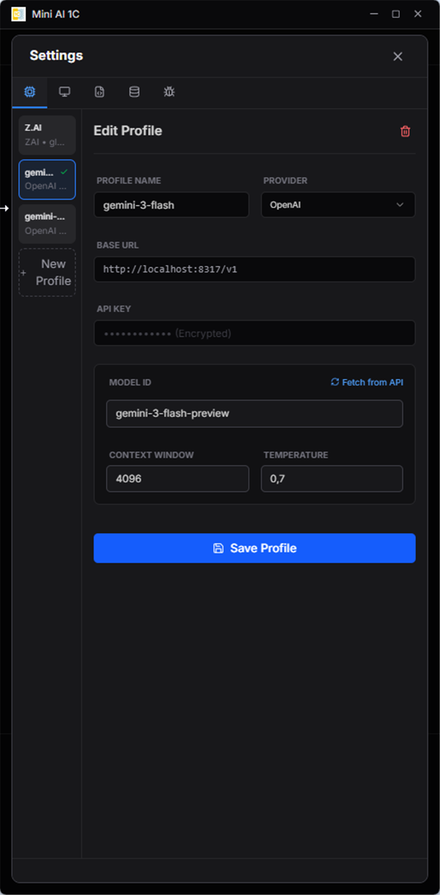
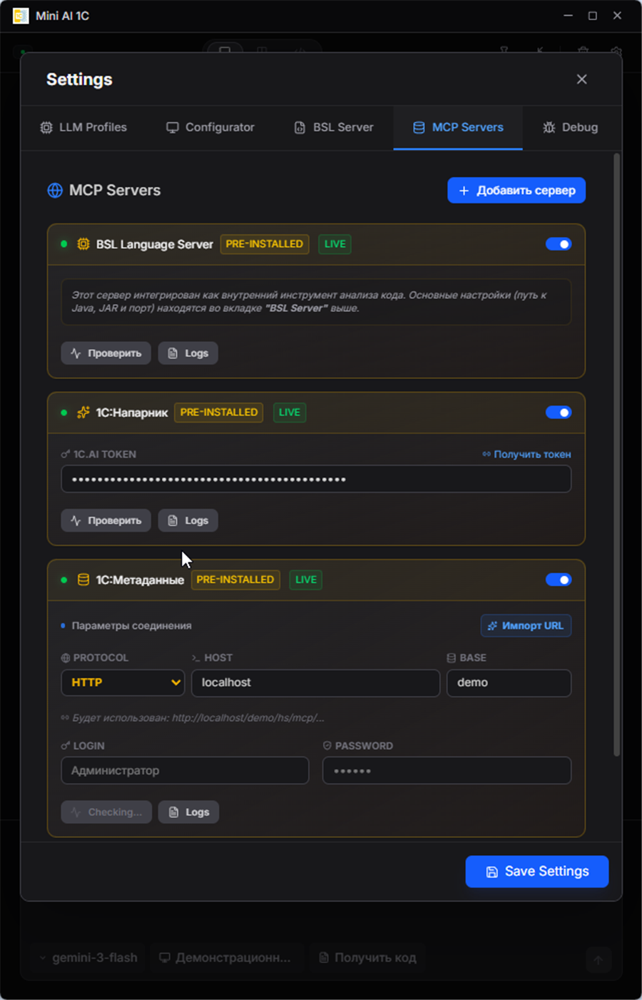
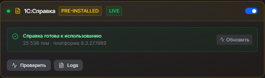
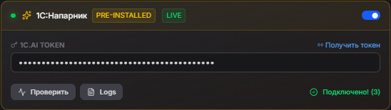

# Mini AI 1C

> [!WARNING]
> ⚠️ **Данное приложение находится в стадии активной разработки.**
> Возможны ошибки и изменения в функционале.

**Mini AI 1C** — нативный десктопный ИИ-ассистент для разработчиков **1C:Предприятие**, построенный на базе Tauri 2 и React 19. Работает прямо рядом с открытым Конфигуратором: захватывает код модуля, отправляет его ИИ, получает умные правки и вставляет результат обратно — всё в два клика.

---

## ⚡ Почему Mini AI 1C?

| | |
|---|---|
| 🆓 **Бесплатно через Qwen Code CLI** | Подключите Qwen Code (2000 запросов/день бесплатно) через OAuth — без API-ключей и без оплаты. |
| 👥 **Несколько аккаунтов** | Переключайтесь между профилями ИИ в один клик: Qwen (бесплатно), Claude, Gemini, GPT — как удобно. |
| 🩺 **BSL Language Server** | Встроенный линтер BSL прямо в редакторе — синтаксические ошибки подсвечиваются до отправки в ИИ. |
| 🔌 **Предустановленные MCP-серверы** | 1С:Справка, 1С:Напарник, 1С:Метаданные, 1С: Поиск по конфигурации — работают «из коробки», без ручной настройки. |
| 🎙️ **Голосовой ввод** | Надиктуйте задачу голосом, не отрывая рук от клавиатуры. |

---

**1. Получение кода из Конфигуратора и объяснение кода:**


**2. Добавление описания к процедурам и функциям:**


**3. Исправление ошибок BSL:**


---

## 📸 Скриншоты

<details>
<summary>Показать скриншоты</summary>

### Главный экран



---

### Чат и код

<table>
  <tr>
    <td><br/><sub>ИИ-чат с BSL кодом</sub></td>
    <td><br/><sub>Auto-Proof и инлайн-диффы</sub></td>
  </tr>
</table>

---

### Настройки

<table>
  <tr>
    <td><br/><sub>Настройки LLM профиля</sub></td>
    <td><br/><sub>MCP серверы</sub></td>
  </tr>
  <tr>
    <td><br/><sub>BSL Language Server</sub></td>
    <td></td>
  </tr>
</table>

</details>

---

## 🎯 Для чего предназначен

Mini AI 1C создан для **быстрой работы в рамках одного модуля**: рефакторинга, генерации процедур, анализа и исправления кода на BSL.

### ✅ Когда использовать

| Задача | Пример |
|---|---|
| **Генерация кода** | «Напиши СКД-запрос для остатков по складу» |
| **Рефакторинг модуля** | Упростить, переименовать переменные, разбить на функции |
| **Анализ фрагмента** | «Почему эта процедура работает медленно?» |
| **Исправление ошибок** | Автоматически через BSL Language Server |
| **Объяснение кода** | «Что делает этот блок?» |
| **Генерация типовых конструкций** | Запросы, обходы таблиц, HTTP-запросы, XML и т.д. |

### ❌ Когда НЕ использовать

> [!IMPORTANT]
> **Приложение работает только с контекстом текущего модуля.** Оно не имеет доступа к полной структуре вашей конфигурации: составу метаданных, связям между объектами, реквизитам других документов и справочников.

| Ограничение | Что это значит |
|---|---|
| **Нет анализа всей конфигурации** | ИИ не знает, какие объекты есть в вашей базе (если не подключён MCP-сервер «1C:Метаданные») |
| **Нет понимания бизнес-логики** | ИИ не знает о связях между модулями и их назначении |
| **Нет контекста других модулей** | Код в других модулях не виден ИИ |

💡 **Вывод**: использование MCP-сервера [1C:Метаданные](#1cметаданные) частично снимает эти ограничения, предоставляя ИИ доступ к структуре базы в режиме реального времени.

---

## 🚀 Возможности

- **Продвинутый ИИ-чат с контекстом**:
  - Обсуждайте ваш код с ИИ, который понимает синтаксис и контекст BSL.
  - **Прозрачность**: наблюдайте за ходом внутренних рассуждений моделей (теги `<thinking>` у Claude) и выполнением tool calls в реальном времени.
  - **Редактирование сообщений**: измените запрос и перезапустите чат с нужного места.

- **Интеллектуальная система промптов**:
  - **Профили поведения**: переключайтесь между режимом «Свой код» (свободный рефакторинг) и «Чужой код» (жесткая изоляция правок комментариями).
  - **Библиотека правил**: создавайте свои шаблоны инструкций для ИИ (например, «Всегда использовать БСП» или «Запрет на использование Сообщить()»).
  - **Глобальная роль**: настройте системный префикс (System Prompt) под ваш стиль разработки.

- **Умная маркировка изменений**:
  - Автоматическое выделение правок комментариями `// Доработка START / END`.
  - Гибкая настройка шаблонов с использованием переменных: `{date}`, `{datetime}`, `{newCode}`, `{oldCode}`.

- **Auto-Proof и Интерактивные Диффы**:
  - **Режим Diff (Search/Replace)**: ИИ предлагает точечные изменения, что позволяет работать даже с огромными модулями без потери контекста.
  - **Инлайн-диффы**: визуальное сравнение блоков «ДО/ПОСЛЕ» прямо в чате.
  - **Построчное управление**: принимайте или отменяйте конкретные части кода прямо в редакторе (кнопки «Принять» / «Отменить» на полях Monaco Editor).
  - **Массовое применение**: подтверждайте все изменения разом («Принять всё») или выборочно.
  - **Отмена**: откатите изменения к оригиналу в один клик.

- **Self-Healing (Авто-исправление)**:
  - После генерации кода ИИ валидирует результат через BSL Language Server.
  - При наличии синтаксических ошибок — автоматически исправляет их (цикл Code → Check → Fix).

- **Интеграция с Конфигуратором 1С (Windows)**:
  - **Получить код**: мгновенно забирайте текст модуля или выделенный фрагмент из активного окна Конфигуратора.
  - **Вставить результат**: отправляйте исправленный код обратно в Конфигуратор в один клик.

- **BSL Language Server**:
  - Подсветка синтаксиса и линтинг прямо в редакторе Monaco Editor.
  - Управление BSL LS прямо из настроек: включить, проверить статус, перезапустить.
  - **Встроенная диагностика**: автоматическая проверка доступности Java, JAR-файла и WebSocket-соединения с выводом детальных рекомендаций по устранению проблем.

- **Портативность (True Portability)**:
  - Приложение работает как одиночный `.exe` файл, не требующий установки или наличия папок рядом.
  - Все встроенные MCP-серверы и ресурсы встроены в бинарный файл (`include_bytes!`) и автоматически разворачиваются при первом запуске.

- **Поддержка MCP (Model Context Protocol)**:
  - Подключайте любые внешние MCP-серверы (stdio/SSE).
  - В приложении предустановлены серверы для работы с 1С.

- **🆓 Qwen Code CLI — бесплатный доступ к мощному ИИ**:
  - Авторизация через официальный **OAuth Device Flow** (открываете ссылку, подтверждаете в браузере — готово).
  - Токены хранятся в системном **Keychain** — безопасно, без файлов с секретами.
  - Счётчик использованных запросов отображается прямо в интерфейсе чата и настройках.
  - Поддержка моделей: **Qwen3.5 Plus (1M context)**, Qwen3 Coder Plus, Qwen3 Coder Flash.

- **Гибкое управление LLM**:
  - Поддержка Ollama, OpenAI, Anthropic, DeepSeek, OpenRouter и других OpenAI-совместимых провайдеров.
  - Авто-подгрузка списка моделей и проверка связи.

- **Голосовой ввод (Speech-to-Text)**:
  - Надиктуйте задачу голосом — ассистент мгновенно преобразует речь в текст.
  - **Технология**: используется нативный **Web Speech API**, что обеспечивает высокую скорость и работу без дополнительных API-ключей.
  - Полная поддержка русского языка и потоковый ввод текста.

- **Modern UI**:
  - Нативное приложение на базе Tauri 2 + React 19, тёмная тема.
  - Сохранение истории чатов и положения окна между сессиями.

---

## 🔌 Встроенные MCP-серверы

### 1С:Справка



**Описание**: Предоставляет ИИ доступ к официальной справке платформы 1С:Предприятие 8.3. ИИ может мгновенно получать информацию из Синтакс-помощника по методам, свойствам и конструкциям языка BSL, что значительно повышает качество генерации и анализа кода.

**Как подключить**:
1. Перейдите в **Настройки** → **MCP Servers**.
2. В карточке **1С:Справка** переключите тумблер в состояние **Enabled**.
3. При первом запуске приложение автоматически найдет установленную платформу 1С и проиндексирует справку (занимает 1-3 минуты).
4. После завершения индексации статус сменится на **Ready**, отобразив версию платформы и количество проиндексированных тем.

---

### 1C:Напарник (1C.ai)



**Описание**: Доступ к облачному API 1C.ai. ИИ может объяснять сложные моменты BSL, диагностировать код на ошибки и давать рекомендации по стандартам разработки 1С.

**Как подключить**:
1. Перейдите в **Настройки** → **MCP Servers**.
2. В карточке **1C:Напарник** введите ваш персональный API Token (получить на [code.1c.ai/tokens](https://code.1c.ai/tokens/)).
3. Переключите тумблер в состояние **Enabled** и нажмите **Проверить**.

---

### 1C:Метаданные


**Описание**: Даёт ИИ возможность исследовать структуру вашей конкретной базы — состав справочников, документов, реквизиты, табличные части, перечисления. Позволяет генерировать код, который сразу готов к работе с вашими данными. Снимает основное ограничение приложения.

Использует HTTP-сервисы расширения [1c_mcp](https://github.com/vladimir-kharin/1c_mcp).

**Как подключить**:
1. Установите расширение `1c_mcp` в вашу информационную базу.
2. Опубликуйте базу на веб-сервере (Apache или IIS).
3. В настройках укажите протокол, адрес сервера и имя публикации.
4. Введите логин/пароль пользователя 1С.
5. Нажмите **Проверить** — статус должен смениться на зелёный чек.

---

### 1С: Поиск по конфигурации


**Описание**: Высокопроизводительный сервер для поиска и навигации по исходным кодам конфигураций 1С:Предприятие (выгрузка в файлы). Оптимизирован для работы с огромными конфигурациями (20ГБ+, 100к+ файлов) даже на медленных HDD.

**Возможности**:
- **Мгновенный поиск символов**: Поиск определений процедур и функций за миллисекунды (использует инкрементальный парсер Tree-sitter).
- **Интеллектуальный Grep**: Полнотекстовый поиск по `.bsl` и `.xml` файлам с поддержкой регулярных выражений.
- **Анализ метаданных**: Понимание структуры объектов (реквизиты, табличные части) через парсинг файлов выгрузки.
- **Инкрементальный индекс**: Автоматическое обновление индекса только для измененных файлов.

**Как подключить**:
1. Перейдите в **Настройки** → **MCP Servers**.
2. В карточке **1С: Поиск по конфигурации** укажите абсолютный путь к директории с исходниками конфигурации (переменная `ONEC_CONFIG_PATH`).
3. Переключите тумблер в состояние **Enabled**.
4. При первом запуске сервер проиндексирует файлы (скорость зависит от объема кода, используется параллельный парсинг на Rust).

💡 Подробную техническую информацию и описание алгоритмов можно найти в [документации сервера](tauri-app/mcp-1c-search/README.md).

---

## 🛠 Технологический стек

| Слой | Технологии |
|---|---|
| **Frontend** | React 19, TypeScript, TailwindCSS, Vite, Monaco Editor |
| **Backend/Core** | Tauri 2 (Rust) |
| **Language Server** | BSL Language Server (WebSocket/Stdio) |
| **AI Integration** | MCP Client, OpenAI-совместимый API |
| **Windows** | Win32 API (интеграция с окнами Конфигуратора) |

## 📋 Требования

1. **Node.js** (v18+) — необходим для работы MCP-серверов.
2. **Java Runtime Environment (JRE)** (v17+) — необходим для работы BSL Language Server.
3. **Windows 10/11** — для полноценной интеграции с Конфигуратором 1С.

## ⚡ Установка и Запуск (Development)

```bash
# 1. Клонируйте репозиторий
git clone https://github.com/hawkxtreme/mini-ai-1c
cd mini-ai-1c/tauri-app

# 2. Установите зависимости
npm install

# 3. Запустите в режиме разработки
npm run app:dev
```

## 📦 Сборка (Production)

```bash
npm run app:build
```
Файлы сборки будут находиться в `src-tauri/target/release/bundle`.

## 🔧 Настройка

- Нажмите иконку **Настройки** (шестерёнка) в приложении.
- Настройте профили LLM и укажите пути к Java/BSL LS.
- В разделе **MCP Servers** подключите дополнительные инструменты.

## ⚠️ Известные проблемы

### Ошибка «Could not find the WebView2 Runtime»

**Причина**: Отсутствует Microsoft Edge WebView2 Runtime — компонент для работы Tauri-приложений на Windows.

**Решение**: Скачайте и установите [WebView2 Runtime Evergreen Bootstrapper](https://go.microsoft.com/fwlink/p/?LinkId=2124703).

> **Примечание**: WebView2 Runtime устанавливается один раз и работает для всех приложений на базе Tauri/Electron.

## 📄 Лицензия

Проект распространяется под кастомной лицензией **(Attribution Non-Commercial License)**. 
- ❌ **Запрещено** коммерческое использование.
- ✅ **Обязательно** указание авторства: `@hawkxtreme`.

Подробности в файле `LICENSE`.

## 🤝 Благодарности

- **Владимир Харин ([@vladimir-kharin](https://github.com/vladimir-kharin))** — за расширение [1c_mcp](https://github.com/vladimir-kharin/1c_mcp), которое легло в основу интеграции с метаданными 1С.
- **[@alkoleft](https://github.com/alkoleft)** — за грамматику [tree-sitter-bsl](https://github.com/alkoleft/tree-sitter-bsl), используемую для парсинга BSL-кода в MCP-сервере поиска по конфигурации.
- **[@Arman-Kudaibergenov](https://github.com/Arman-Kudaibergenov)** — за проект [bsl-atlas](https://github.com/Arman-Kudaibergenov/bsl-atlas), послуживший источником вдохновения для построения индекса символов и call graph BSL.
- **[@SteelMorgan](https://github.com/SteelMorgan)** — за проект [spring-mcp-1c-copilot](https://github.com/SteelMorgan/spring-mcp-1c-copilot), идеи из которого были использованы при разработке MCP 1С Напарника.

---

*Создано с ❤️ для сообщества 1С · [Telegram](https://t.me/hawkxtreme)*
